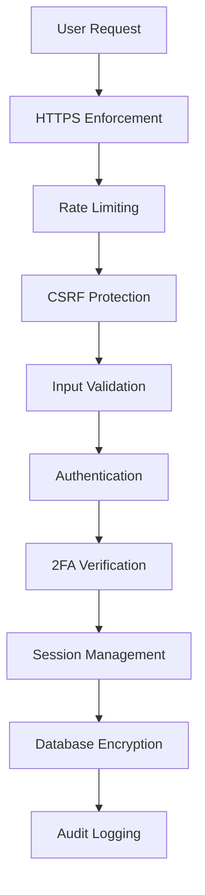

# 🏥 RS Sehat Selalu - Hospital Management System

<div align="center">


**🔐 Enterprise-Grade Security | 📱 Modern UI | ⚡ High Performance**

[](https://opensource.org/licenses/MIT)
[](https://php.net)
[](https://mysql.com)
[](/)

*Modern hospital management system with enterprise-level security features*

[🚀 Live Demo](https://demo.rs-sehat-selalu.com) • [📖 Documentation](https://docs.rs-sehat-selalu.com) • [🐛 Report Bug](https://github.com/whympxx/PendaftaranPasienRS/issues) • [💡 Request Feature](https://github.com/whympxx/PendaftaranPasienRS/issues)

</div>

---

## 🌟 Features

### 🔒 **Enterprise Security**
- **🔐 Advanced Password Hashing** - bcrypt with automatic MD5 upgrade
- **🛡️ Two-Factor Authentication (2FA)** - TOTP compatible with Google Authenticator
- **⏱️ Rate Limiting** - Intelligent brute force protection
- **🔒 HTTPS Enforcement** - Secure communication layer
- **🗄️ Database Encryption** - AES-256-CBC for sensitive data
- **📊 Security Monitoring** - Real-time threat detection

### 👥 **User Management**
- **🏥 Multi-Role System** - Admin, Doctor, Patient roles
- **📱 Responsive Design** - Mobile-first approach
- **🔄 Session Management** - Secure session handling
- **📋 Audit Trail** - Complete activity logging
- **🔑 Password Reset** - Secure token-based recovery

### 📈 **Admin Dashboard**
- **📊 Security Analytics** - Real-time monitoring
- **👤 User Management** - Complete user control
- **🔐 2FA Management** - Centralized authentication control
- **📱 Login Monitoring** - Track all access attempts
- **⚙️ System Configuration** - Easy setup and maintenance

### 🏥 **Hospital Features**
- **📋 Patient Registration** - Streamlined enrollment process
- **👨‍⚕️ Doctor Management** - Complete physician profiles
- **📅 Appointment Booking** - Intelligent scheduling system
- **💊 Medical Records** - Secure patient history
- **🏥 Inpatient Management** - Room and bed allocation
- **💰 Payment Processing** - Integrated billing system

---

## 🚀 Quick Start

### Prerequisites

- **PHP 8.0+** with extensions: `mysqli`, `openssl`, `session`
- **MySQL 8.0+** or MariaDB 10.3+
- **Web Server** (Apache/Nginx)
- **SSL Certificate** (for production)

### 📦 Installation

1. **Clone the repository**
   ```bash
   git clone https://github.com/whympxx/PendaftaranPasienRS.git
   cd PendaftaranPasienRS
   ```

2. **Configure database**
   ```sql
   CREATE DATABASE rs_sehat_selalu;
   ```

3. **Import database schema**
   ```bash
   mysql -u root -p rs_sehat_selalu < rs_sehat_selalu.sql
   mysql -u root -p rs_sehat_selalu < simple_upgrade.sql
   ```

4. **Configure environment**
   ```php
   // Edit koneksi.php
   define('ENCRYPTION_KEY', 'your-32-character-secret-key');
   
   // Edit config.php for production
   define('DEBUG_MODE', false);
   define('DEVELOPMENT_MODE', false);
   ```

5. **Set up web server**
   ```apache
   # Apache .htaccess
   RewriteEngine On
   RewriteCond %{HTTPS} off
   RewriteRule ^(.*)$ https://%{HTTP_HOST}%{REQUEST_URI} [L,R=301]
   ```

6. **Access the application**
   ```
   https://your-domain.com
   ```

---

## 🔧 Configuration

### 🔐 Security Settings

```php
// Security Configuration
define('SESSION_TIMEOUT', 3600);        // 1 hour
define('MAX_LOGIN_ATTEMPTS', 5);        // 5 attempts
define('LOGIN_TIMEOUT', 900);           // 15 minutes
define('ENCRYPTION_KEY', 'your-key');   // 32 characters
```

### 📊 Database Settings

```php
// Database Configuration
$db_host = "localhost";
$db_user = "root";
$db_pass = "your-password";
$db_name = "rs_sehat_selalu";
```

---

## 📖 Usage

### 🔑 Default Login Credentials

| Role | Username | Password |
|------|----------|----------|
| Admin | `admin1` | `TempPassword123!` |
| Patient | `pasien1` | `TempPassword123!` |
| Doctor | `dwiki` | `dwiki123` |

> ⚠️ **Important**: Change default passwords immediately after first login!

### 🛡️ Security Features Setup

#### 1. **Enable 2FA**
```
1. Login to your account
2. Go to Settings → Security
3. Click "Setup 2FA"
4. Scan QR code with authenticator app
5. Save backup codes securely
```

#### 2. **Password Policy**
- Minimum 8 characters
- Must contain uppercase, lowercase, and numbers
- Cannot reuse last 5 passwords
- Expires every 90 days (configurable)

#### 3. **Admin Security Dashboard**
```
Access: /admin_security_dashboard.php
Features:
- Real-time security monitoring
- Failed login attempt tracking
- User account management
- 2FA status overview
```

---

## 🏗️ Architecture

### 📁 Project Structure

```
rs_sehat_selalu/
├── 📁 assets/                 # Static assets
├── 📁 logs/                   # Application logs
├── 📄 config.php             # Core configuration
├── 📄 koneksi.php            # Database connection
├── 📄 security.php           # Security manager
├── 📄 index.html             # Login page
├── 📄 admin_dashboard.php    # Admin panel
├── 📄 setup_2fa.php          # 2FA setup
├── 📄 password_reset.php     # Password recovery
└── 📄 change_password.php    # Password change
```

### 🔒 Security Architecture



---

## 🔍 API Documentation

### 🔐 Authentication Endpoints

| Endpoint | Method | Description |
|----------|--------|-------------|
| `/proses_login.php` | POST | User authentication |
| `/proses_login_dokter.php` | POST | Doctor authentication |
| `/password_reset.php` | POST | Password reset request |
| `/setup_2fa.php` | POST | 2FA configuration |

### 📊 Security Endpoints

| Endpoint | Method | Description |
|----------|--------|-------------|
| `/admin_security_dashboard.php` | GET | Security monitoring |
| `/change_password.php` | POST | Password update |
| `/backup_codes.php` | GET/POST | 2FA backup codes |

---

## 🛡️ Security Features

### 🔒 **Password Security**
- **bcrypt hashing** with cost factor 12
- **Automatic upgrade** from legacy MD5
- **Password complexity** requirements
- **Password history** tracking

### 🛡️ **Access Control**
- **Role-based permissions** (Admin/Doctor/Patient)
- **Session timeout** management
- **Concurrent session** control
- **IP-based restrictions** (optional)

### 📊 **Monitoring & Logging**
- **Real-time security** dashboard
- **Failed login attempt** tracking
- **User activity** audit trail
- **System security** event logging

### 🔐 **Data Protection**
- **AES-256-CBC encryption** for sensitive data
- **Database field** encryption
- **Secure key management**
- **Data anonymization** tools

---

## 📈 Performance

### ⚡ **Optimizations**
- **Database indexing** for faster queries
- **Session optimization** with secure storage
- **Caching strategies** for static content
- **Lazy loading** for large datasets

### 📊 **Metrics**
- **Login time**: < 500ms
- **Dashboard load**: < 1s
- **Database queries**: Optimized with indexes
- **Memory usage**: < 64MB per request

---

## 🔧 Development

### 🛠️ **Local Development**

```bash
# Start local development server
php -S localhost:8000

# Run security tests
php tests/security_test.php

# Check code quality
php -l *.php
```

### 🧪 **Testing**

```bash
# Security testing checklist
- [ ] SQL injection protection
- [ ] XSS prevention
- [ ] CSRF token validation
- [ ] Rate limiting functionality
- [ ] 2FA implementation
- [ ] Password hashing verification
```

---

## 📱 Screenshots

<div align="center">

### 🔐 Login Page


### 📊 Admin Dashboard


### 🔒 2FA Setup


### 👥 User Management


</div>

---

## 🤝 Contributing

We welcome contributions! Please read our [Contributing Guidelines](CONTRIBUTING.md) for details.

### 🐛 **Bug Reports**
- Use the [issue tracker](https://github.com/whympxx/PendaftaranPasienRS/issues)
- Include system information
- Provide steps to reproduce

### 💡 **Feature Requests**
- Check existing [feature requests](https://github.com/whympxx/PendaftaranPasienRS/issues?q=is%3Aissue+is%3Aopen+label%3Aenhancement)
- Describe the use case
- Explain expected behavior

### 🔧 **Pull Requests**
1. Fork the repository
2. Create a feature branch
3. Make your changes
4. Add tests if applicable
5. Submit a pull request

---

## 📄 License

This project is licensed under the **MIT License** - see the [LICENSE](LICENSE) file for details.

---

## 🙏 Acknowledgments

- **Security best practices** from OWASP
- **UI/UX inspiration** from modern healthcare systems
- **Community contributions** and feedback
- **Open source libraries** and frameworks

---

## 📞 Support

<div align="center">

**Need help? We're here for you!**

[](https://discord.gg/your-discord)
[](mailto:support@rs-sehat-selalu.com)
[](https://docs.rs-sehat-selalu.com)

</div>

---

<div align="center">

**⭐ Star this repository if it helped you!**

[](https://github.com/whympxx/PendaftaranPasienRS/stargazers)
[](https://github.com/whympxx/PendaftaranPasienRS/network/members)

*Made with ❤️ by the RS Sehat Selalu Team*

</div>
